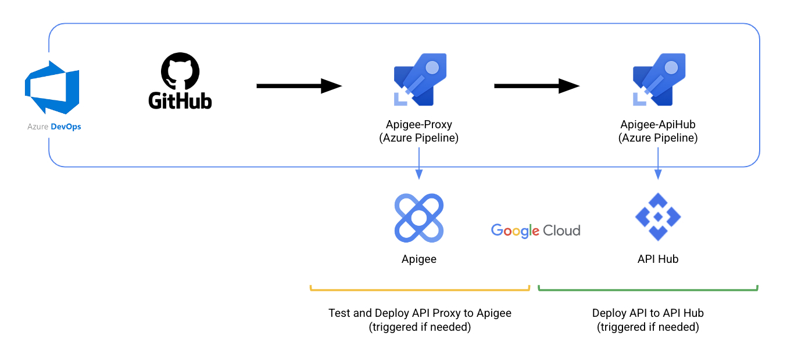
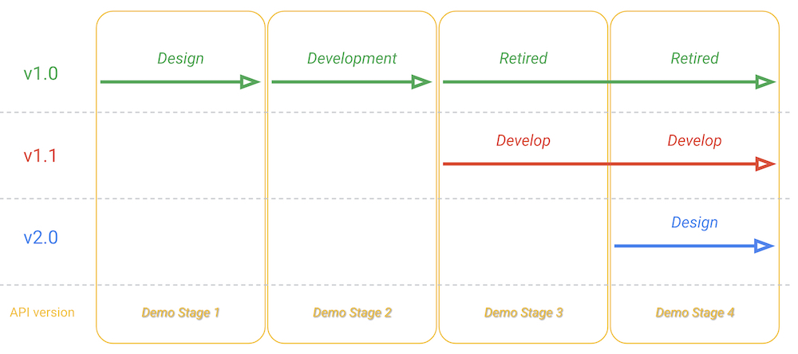
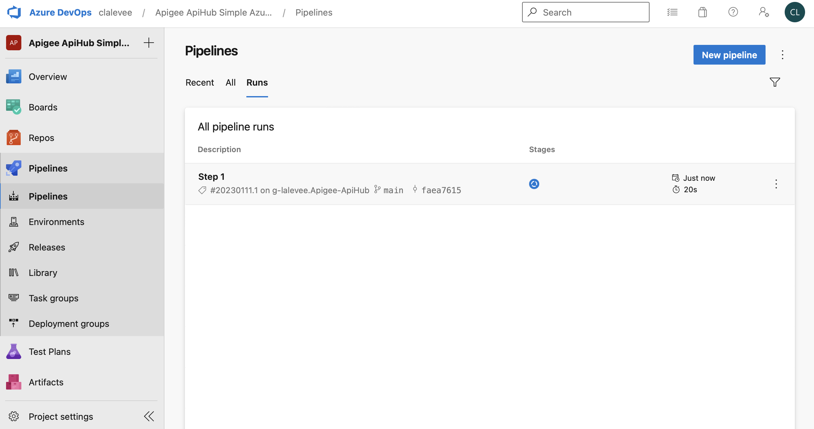
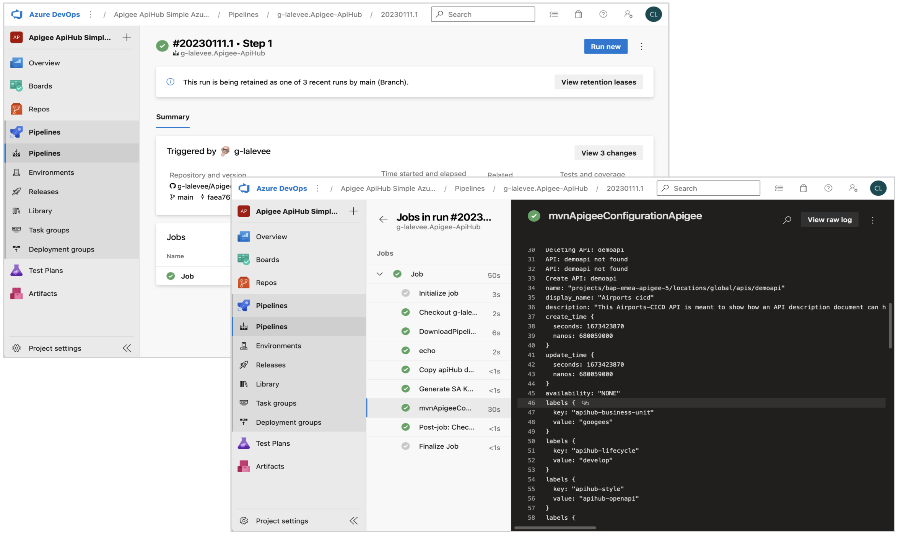
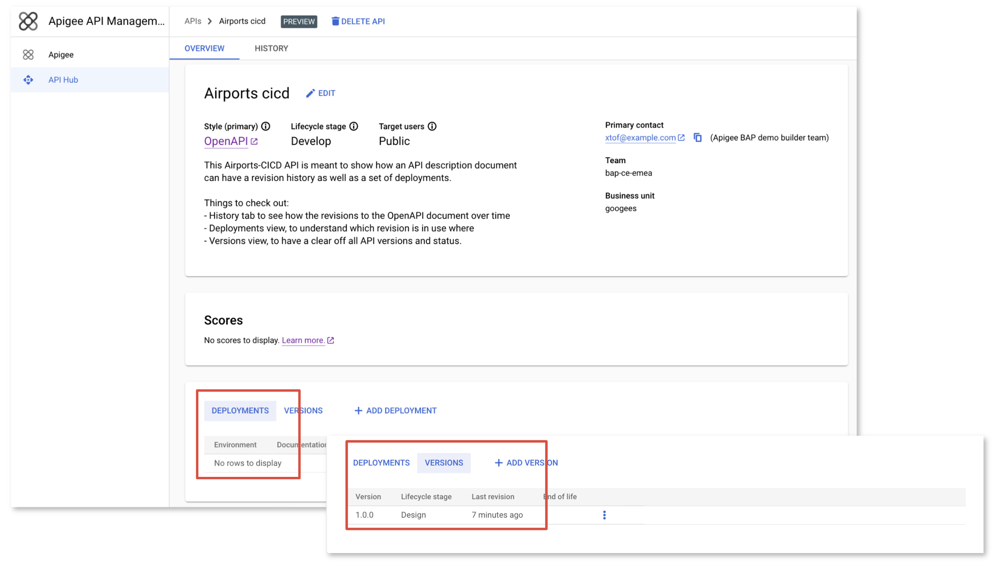
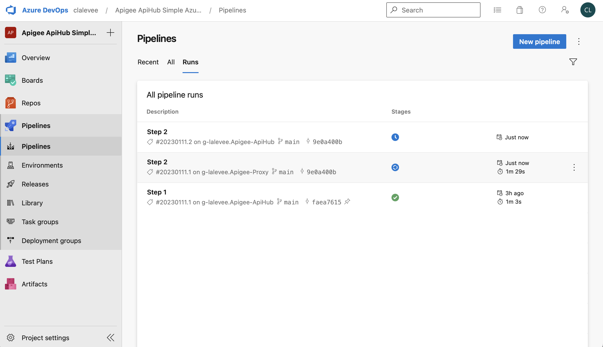
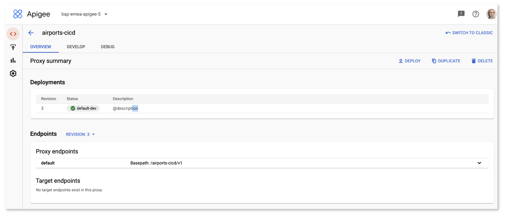
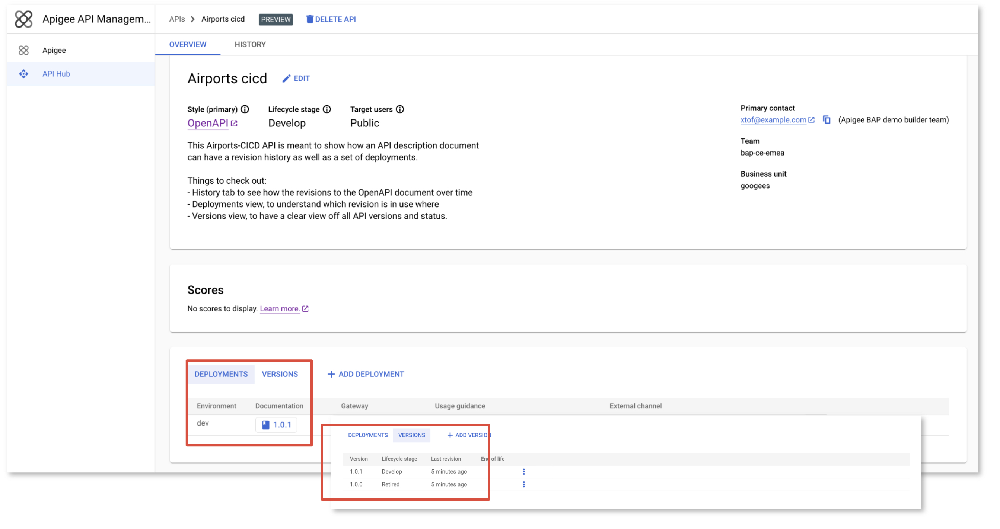
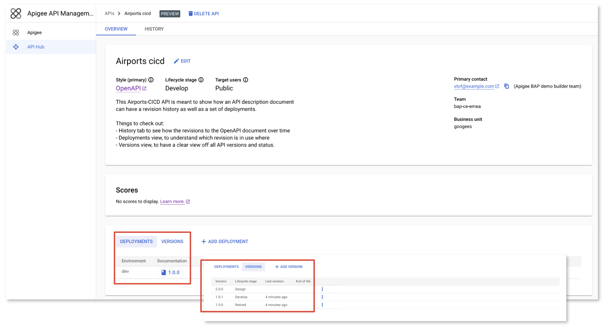

# Apigee & API Hub CI/CD using GitHub, Azure Pipeline 

[](https://shields.io/)


**This is not an official Google product.**<BR>This implementation is not an official Google product, nor is it part of an official Google product. Support is available on a best-effort basis via GitHub.

***

## Goal

Implementation of a CI/CD pipeline for Apigee using
[Azure Pipeline](https://docs.microsoft.com/en-us/azure/devops/pipelines/get-started/what-is-azure-pipelines?view=azure-devops) and Apigee Maven Plugins.


### The CICD pipeline includes:

- An Apigee proxy to be deployed in Apigee X/hybrid (Edge/OPSK not supported)
    - Folder **apiProxy**
    - Static Apigee Proxy code analysis using [apigeelint](https://github.com/apigee/apigeelint)
    - Static JS code analysis using [eslint](https://eslint.org/)
    - Unit JS testing using [mocha](https://mochajs.org/)
    - Integration testing of the deployed proxy using [apickli](https://github.com/apickli/apickli)
    - Packaging and deployment of the API proxy bundle using
    [Apigee Deploy Maven Plugin](https://github.com/apigee/apigee-deploy-maven-plugin)

- A corresponding API specification file (OAS, Open Api Specification) and its configuration file to be published on Apigee Api Hub (several versions)
    - Folder **apiHub**
    - Publication of the API into Apigee Api Hub using
    [Apigee Registry Maven Plugin](https://github.com/apigee/apigee-registry-maven-plugin)


### Pipeline Principle



2 pipelines:
   - Apigee-Proxy: Deploy proxy to Apigee if it has changed
   - Apigee-ApiHub: Publish the specification on API Hub if it has changed
  

## Limitations & Requirements

- The authentication to the Apigee X / Apigee hybrid API is done using a GCP Service Account. See CI/CD Configuration [Instructions](https://xxx).
- Apigee Hub must be provisioned. See [Api Hub Documentation](https://cloud.google.com/apigee/docs/api-hub/get-started-api-hub)
- The setup described in this reference implementation is based on Azure DevOps pipeline. You must have a Azure account you will use to create a pipeline linked to this GitHub repository. See [Azure DevOps Services](https://azure.microsoft.com/en-us/services/devops/).

***

<BR>

## CI/CD Configuration Instructions

### Initialize a GitHub Repository

Create a GitHub repository to hold your API Proxy. 

To use the `Apigee-ApiHub-Simple-Azure-Pipeline`
in your GitHub repository like `github.com/my-user/my-apihub-proxy-repo`, follow these
steps:

```bash
git clone git@github.com:g-lalevee/Apigee-ApiHub-Simple-Azure-Pipeline.git
cd Apigee-ApiHub-Simple-Azure-Pipeline
git init
git remote add origin git@github.com:my-user/my-apihub-proxy-repo.git
git checkout -b feature/cicd-pipeline
git add .
git commit -m "initial commit"
git push -u origin feature/cicd-pipeline
```

### Google Cloud: Create Service Account

Apigee X deployement requires a GCP Service Account with the following roles (or a custom role with all required permissions):

- Apigee Environment Admin
- Cloud Apigee Registry Editor

To create it in your Apigee organization's GCP project, use following gcloud commands (or GCP Web UI):

```sh
SA_NAME=<your-new-service-account-name>

gcloud iam service-accounts create $SA_NAME --display-name="Azure Service Account"

PROJECT_ID=$(gcloud config get-value project)
Azure_SA=$SA_NAME@$PROJECT_ID.iam.gserviceaccount.com

gcloud projects add-iam-policy-binding "$PROJECT_ID" \
  --member="serviceAccount:$Azure_SA" \
  --role="roles/apigee.environmentAdmin"

gcloud projects add-iam-policy-binding "$PROJECT_ID" \
  --member="serviceAccount:$Azure_SA" \
  --role="roles/apigee.apiAdmin"

gcloud projects add-iam-policy-binding "$PROJECT_ID" \
  --member="serviceAccount:$Azure_SA" \
  --role="roles/apigeeregistry.editor"

gcloud iam service-accounts keys create $SA_NAME-key.json --iam-account=$Azure_SA --key-file-type=json 

```

Copy `<your-new-service-account-name>-key.json` file content to clipboard. 


### Azure Pipeline Configuration 

You will create 2 pipelines Apigee-Proxy and Apigee-ApiHub.


1.  Create Apigee-Proxy pipeline<BR>
In your [Azure DevOps account](https://dev.azure.com), create a new project. From the **Pipelines** menu, select **Pipeline** and select **GitHub**, then select your cloned repository as source repository. <BR>

2.  Add pipeline variable `GCP_SERVICE_ACCOUNT`, to store your GCP Service Account json key:
- Click **Variables** button to add variables.
- Click the **+** button.<BR>In the New variable modal, fill in the details:
  - Key: GCP_SERVICE_ACCOUNT
  - Value: paste clipboard (containing GCP SA JSON key copied before)
  - Keep this value secret: checked
  - Click the **OK** button

3. Save pipeline: click  **Run** button then **Save**.<BR>

4.  Create Apigee-apiHub pipeline<BR>
- From the **Pipelines** menu, click **New pipeline**
- Select **GitHub** source, then select your cloned repository as source repository.
- Select **Select an existing YAML file**, then from **Path** dropdown, select file **/hub-pipeline.yml**. Click **Continue**.  

5.  Add pipeline variable `GCP_SERVICE_ACCOUNT`, to store your GCP Service Account json key:
- Click **Variables** button to add variables.
- Click the **+** button.<BR>In the New variable modal, fill in the details:
  - Key: GCP_SERVICE_ACCOUNT
  - Value: paste clipboard (containing GCP SA JSON key copied before)
  - Keep this value secret: checked
  - Click the **OK** button

6. Save pipeline: click  **Run** button then **Save**.<BR>

***

<BR>

## Run the demo

### Demo scenario

The pipeline illustrates SDLC for both OAS file and corresponding Apigee proxy (airport-cicd). 

4 steps: 

  - Stage 1: New specification version 1.0.0, API is in **design** stage
  - Stage 2: Specification version 1.0.0, API is in **develop** stage and deployed (Apigee proxy is deployed)
  - Stage 3: New specification version 1.0.1, API is in **develop** stage, but updated (Apigee proxy is updated). Version 1.0.0 is **retired**
  - Stage 4: New specification version 2.0.0 in **design** stage



<BR>

> Note: 
> 
>  - the **demo_files** folder contains specification files and Api Hub configuration files needed for each stages.
>  - Update **demo_files/apiHub/_api_config * .yaml** files to add your own references to your environment components (endpoint hostname, developer portal URL, Apigee dashboard URL, ...)

<BR>

### Set pipeline variables

Using your favorite IDE...

- Update the **/azure-pipeline.yml** file.<BR>
In **Variables** section, change `APIGEE_ORG`, `APIGEE_ENV` and `TEST_HOST` values by your target Apigee organization values. Save it.
- Update the **/hub-pipeline.yml** file.<BR>
In **Variables** section, change `GCP_PROJECT` by your GCP Project name. Save it.


***

### Stage 1: API version 1.0.0 (Design Status)

1.  Update the **apiHub / specs / airport-1.0.0.yaml** file: set **host** with your Apigee environment hostname.
2. Save
3. Commit, Push

Use the Azure DeveOps UI to monitor your pipeline execution and read test reports:

- Go to **Pipelines** menu, then select the **Runs** section. <BR> 
You should see only Apigee-apiHub pipeline running as only API has been updated **design** status:
  - Apigee proxy was not updated/commited
  - API is updated: API version 1.0.0 in **design** status


Click on the pipeline to monitor it.



<BR>

- Click on **Job** to see execution detail. In list of jobs, click on the job you want to see logs.



<BR>

Open API Hub service console and verify that the API 1.0.0 was published in **design** status, with no Deployment.

  

<BR>

***

### Stage 2: : version 1.0.0 (Develop Status, Deployed)

1.  Replace content of file **apiHub / api-config.yaml** file with content of file **demo_file / apiHub / 2_api-config-dev-1.0.yaml**.
2.  Copy folders  **demo_file / apiProxy / apiproxy** and **demo_file / apiProxy / test** to **apiProxy** folder
3. Commit, Push

<BR>

Use the Azure DeveOps UI to monitor your pipelines execution and read test reports:

- Go to **Pipelines** menu, then select the **Runs** section. <BR> 
You should see both Apigee-Proxy pipeline and Apigee-apiHub pipeline running, one then the other:
  - Apigee proxy was updated 
  - API is updated: API version 1.0.0 in **develop** status and deployed

Click on the pipelines to monitor executions.

  

Open Apigee console and verify that the **airports-cicd** was deployed in the right environment.

  


<BR>

***

### Stage 3: version 1.0.1 (Develop Status, Deployed), version 1.0.0 (Retired)

1.  Copy the **demo_file / apiHub / specs / airport-1.0.1.yaml** to **apiHub / specs** folder
2.  Update the **apiHub / specs / airport-1.0.1.yaml** file: set **host** with your Apigee environment hostname.
3. Save
4.  Replace content of file **apiHub / api-config.yaml** file with content of file **demo_file / apiHub / 3_api-config-dev-1.1.yaml**.
5. Commit, Push

<BR>

Use the Azure DeveOps UI to monitor your pipelines execution and read test reports:

You should see only Apigee-apiHub pipeline running: 
  - Apigee proxy was not updated (from Apigee proxy point of view, no difference between API v1.0.0 and API v1.0.1)
  - API is updated: API version 1.0.1 in **Develop** status, and move API 1.0.0 in **Retired** status

Click on the pipeline to monitor executions.


Open API Hub service console and verify that the API 1.0.1 was published in **Develop** status, with one Deployment, and API 1.0.0 was **retired**.

 

<BR>

***

### Stage 4: version 1.0.1 (Develop Status, Deployed), version 1.0.0 (Retired), version 2.0.0 (Design Status)

1.  Copy the **demo_file / apiHub / specs / airport-2.0.0.yaml** to **apiHub / specs** folder
2.  Update the **apiHub / specs / airport-2.0.0.yaml** file: set **host** with your Apigee environment hostname.
3. Save
4. Replace content of file **apiHub / api-config.yaml** file with content of file **demo_file / apiHub / 4_api-config-design-2.0.yaml**
5. Commit, Push

<BR>

Use the Azure DeveOps UI to monitor your pipelines execution and read test reports:

You should see only Apigee-apiHub pipeline running: 
  - Apigee proxy was not updated (from Apigee proxy point of view, no difference between API v1.0.0 and API v1.0.1)
  - API is updated: Api version 2.0.0 in **design** status

Click on the pipeline to monitor executions.

 Open API Hub service console and verify that the API 1.0.1 was published in **Develop** status, with one Deployment, and API 1.0.0 was **retired**, and API 2.0.0 was in **Design**.

  

<BR>